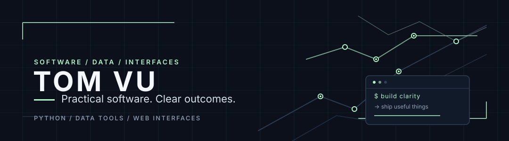

# Building useful things, with the details in the open.

I'm **Tom Vu**. I build tools that turn messy data into clear output and web interfaces that behave well on smaller screens. My focus is practical: readable code, explicit scope, and results you can inspect.

**Python** · **JavaScript** · **HTML & CSS** · **CSV / JSON** · **Browser interfaces**

[Explore the samples](https://github.com/tomlemur57-ux/freelance-samples) · [Inspect ReceiptLens](https://github.com/tomlemur57-ux/receiptlens) · [Discuss a small project](#work-with-me)

## Selected work

### 01 — ReceiptLens

**A clearer view of a Solana Devnet transaction.** A dependency-free JavaScript prototype that validates RPC responses and presents transaction status, fees, programs, transfers and balance changes, with JSON/CSV export. Read-only, with no wallet connection or signing.

[Source & project notes →](https://github.com/tomlemur57-ux/receiptlens)

<table>
<tr>
<td width="50%" valign="top">
<h3>02 — CSV report toolkit</h3>

Turn inconsistent rows into deterministic CSV and JSON output. Python standard-library validation, precise decimal totals, duplicate handling and explicit invalid-row reporting.

<strong>Evidence:</strong> synthetic input/output fixtures and three regression tests run during review.

<a href="https://github.com/tomlemur57-ux/freelance-samples/tree/main/csv-report">Inspect code, fixtures & checks →</a>
</td>
<td width="50%" valign="top">
<h3>03 — Responsive layout repair</h3>

A compact before/after demo of a real CSS grid failure mode: narrow-screen overflow. The corrected rules keep the layout inside its viewport and preserve the keyboard control.

<strong>Evidence:</strong> browser observations at 360, 768 and 1280 px, plus an Enter-key toggle check.

<a href="https://github.com/tomlemur57-ux/freelance-samples/tree/main/layout-fix">Inspect the demo & observations →</a>
</td>
</tr>
</table>

These are public prototypes and synthetic portfolio demonstrations. Each repository documents its scope and verification limits.

## Work with me

Small, well-defined projects: **CSV cleanup and repeatable reports**, or **one HTML/CSS/JavaScript layout issue**. Start with a redacted sample or reproducible page, the desired result, and the deadline; we'll confirm the scope before work.

[CSV / Python inquiry](https://laborx.com/gigs/clean-one-csv-export-and-create-a-repeatable-python-report-123299) · [Website layout inquiry](https://laborx.com/gigs/fix-one-html-css-javascript-layout-issue-123298) · [CSV report package](https://sussygang.gumroad.com/l/rngtkz)
